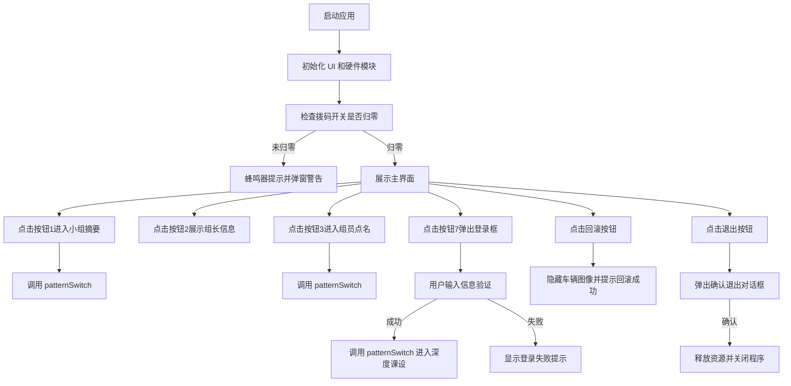
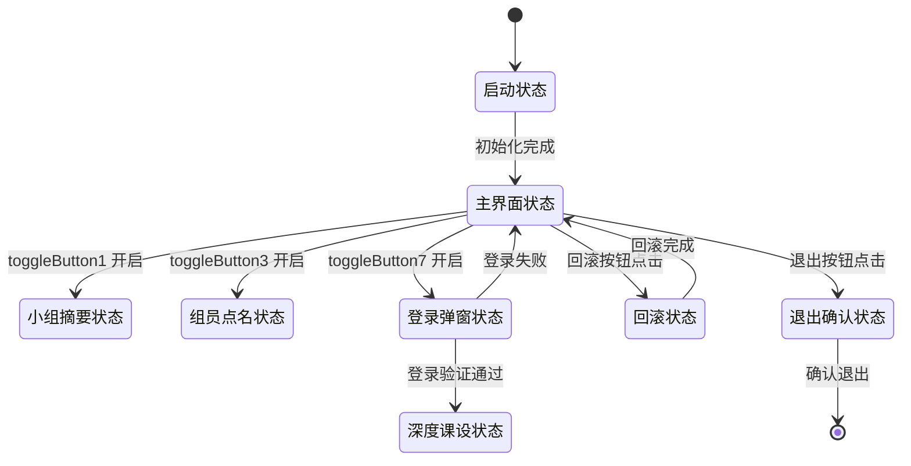
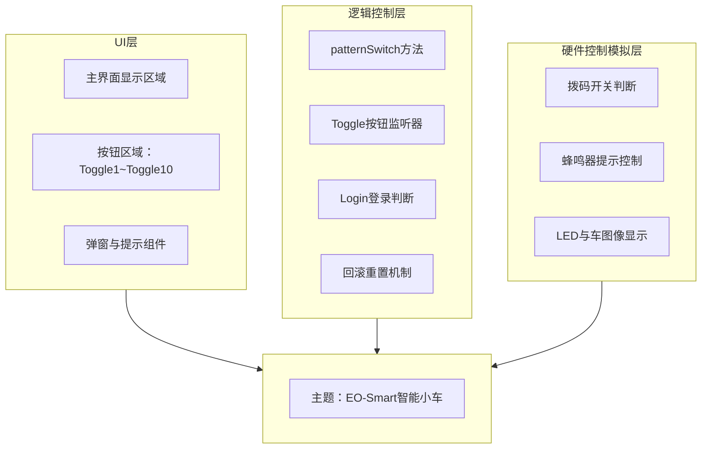
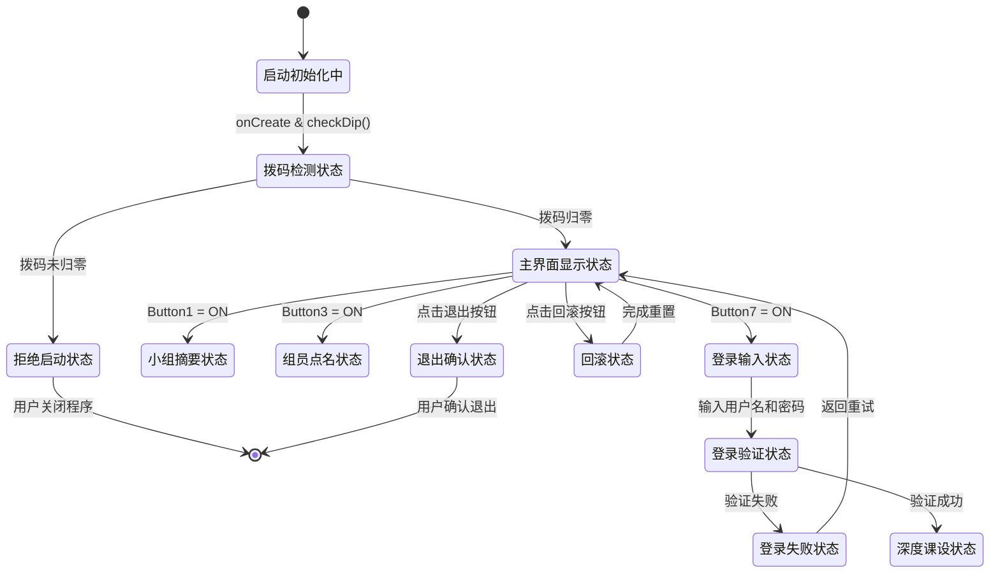
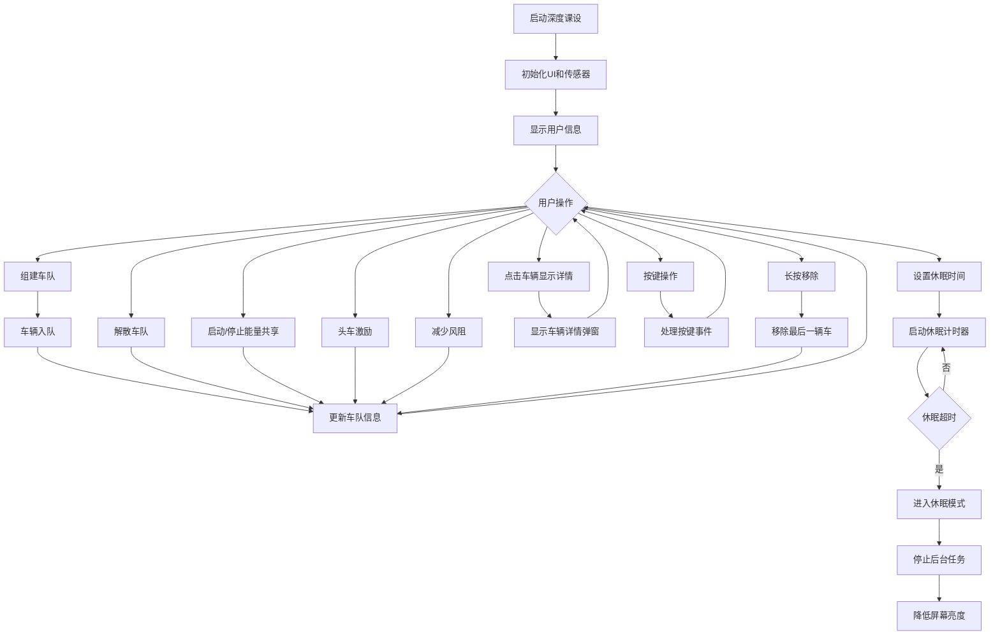
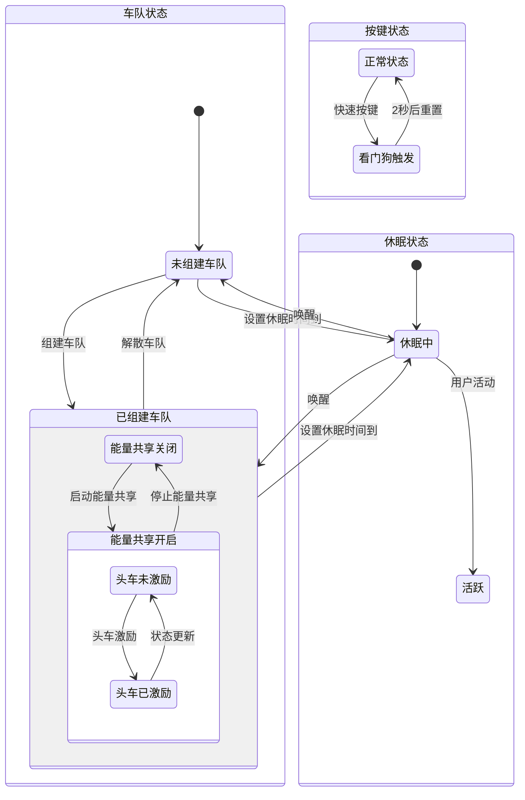

```mermaid
flowchart TD
    Start[启动应用] --> Init[初始化 UI 和硬件模块]
    Init --> CheckDip[检查拨码开关是否归零]
    CheckDip -- 未归零 --> Beep[蜂鸣器提示并弹窗警告]
    CheckDip -- 归零 --> ShowMainUI[展示主界面]
    ShowMainUI --> Toggle1[点击按钮1进入小组摘要]
    Toggle1 --> pattern1[调用 patternSwitch]
    ShowMainUI --> Toggle2[点击按钮2展示组长信息]
    ShowMainUI --> Toggle3[点击按钮3进入组员点名]
    Toggle3 --> pattern2[调用 patternSwitch]
    ShowMainUI --> Toggle7[点击按钮7弹出登录框]
    Toggle7 --> LoginCheck[用户输入信息验证]
    LoginCheck -- 成功 --> pattern3[调用 patternSwitch 进入深度课设]
    LoginCheck -- 失败 --> Error[显示登录失败提示]
    ShowMainUI --> Rollback[点击回滚按钮]
    Rollback --> ResetUI[隐藏车辆图像并提示回滚成功]
    ShowMainUI --> Exit[点击退出按钮]
    Exit --> ConfirmExit[弹出确认退出对话框]
    ConfirmExit -- 确认 --> Finish[释放资源并关闭程序]

```

```mermaid
stateDiagram-v2
    [*] --> 启动状态
    启动状态 --> 主界面状态 : 初始化完成
    主界面状态 --> 小组摘要状态 : toggleButton1 开启
    主界面状态 --> 组员点名状态 : toggleButton3 开启
    主界面状态 --> 登录弹窗状态 : toggleButton7 开启
    登录弹窗状态 --> 深度课设状态 : 登录验证通过
    登录弹窗状态 --> 主界面状态 : 登录失败
    主界面状态 --> 回滚状态 : 回滚按钮点击
    回滚状态 --> 主界面状态 : 回滚完成
    主界面状态 --> 退出确认状态 : 退出按钮点击
    退出确认状态 --> [*] : 确认退出

```

```mermaid
graph TB
    subgraph A[UI层]
        UI1[主界面显示区域]
        UI2[按钮区域：Toggle1~Toggle10]
        UI3[弹窗与提示组件]
    end

    subgraph B[逻辑控制层]
        L1[patternSwitch方法]
        L2[Toggle按钮监听器]
        L3[Login登录判断]
        L4[回滚重置机制]
    end

    subgraph C[硬件控制模拟层]
        H1[拨码开关判断]
        H2[蜂鸣器提示控制]
        H3[LED与车图像显示]
    end

    subgraph D[ ]
        Core[主题：EO-Smart智能小车]
    end

    %% 连接关系
    A -->D
    B-->D
    C-->D

```

```mermaid
stateDiagram-v2
    [*] --> 启动初始化中
    启动初始化中 --> 拨码检测状态 : onCreate & checkDip()

    拨码检测状态 --> 拒绝启动状态 : 拨码未归零
    拒绝启动状态 --> [*] : 用户关闭程序

    拨码检测状态 --> 主界面显示状态 : 拨码归零

    主界面显示状态 --> 小组摘要状态 : Button1 = ON
    主界面显示状态 --> 组员点名状态 : Button3 = ON
    主界面显示状态 --> 登录输入状态 : Button7 = ON

    登录输入状态 --> 登录验证状态 : 输入用户名和密码
    登录验证状态 --> 登录失败状态 : 验证失败
    登录失败状态 --> 主界面显示状态 : 返回重试

    登录验证状态 --> 深度课设状态 : 验证成功

    主界面显示状态 --> 回滚状态 : 点击回滚按钮
    回滚状态 --> 主界面显示状态 : 完成重置

    主界面显示状态 --> 退出确认状态 : 点击退出按钮
    退出确认状态 --> [*] : 用户确认退出

```

```mermaid
graph TD
    A[启动深度课设] --> B[初始化UI和传感器]
    B --> C[显示用户信息]
    C --> D{用户操作}
    D --> E[组建车队]
    D --> F[解散车队]
    D --> G[启动/停止能量共享]
    D --> H[头车激励]
    D --> I[减少风阻]
    D --> J[点击车辆显示详情]
    D --> K[按键操作]
    D --> L[设置休眠时间]
    D --> M[长按移除]
    
    E --> N[车辆入队]
    N --> O[更新车队信息]
    F --> O
    G --> O
    H --> O
    I --> O
    J --> P[显示车辆详情弹窗]
    K --> Q[处理按键事件]
    L --> R[启动休眠计时器]
    R --> S{休眠超时}
    S --> |是| T[进入休眠模式]
    S --> |否| R
    T --> U[停止后台任务]
    U --> V[降低屏幕亮度]
    M --> W[移除最后一辆车]
    W --> O
    
    O --> D
    P --> D
    Q --> D
```

```mermaid
stateDiagram-v2
    未组建车队 --> 已组建车队: 组建车队
    已组建车队 --> 未组建车队: 解散车队
    未组建车队 --> 休眠中: 设置休眠时间到
    已组建车队 --> 休眠中: 设置休眠时间到
    休眠中 --> 未组建车队: 唤醒
    休眠中 --> 已组建车队: 唤醒

    state "车队状态" as C1 {
        [*] --> 未组建车队
        state 已组建车队 {
            能量共享关闭 --> 能量共享开启: 启动能量共享
            能量共享开启 --> 能量共享关闭: 停止能量共享

            state 能量共享开启 {
                头车未激励 --> 头车已激励: 头车激励
                头车已激励 --> 头车未激励: 状态更新
            }
        }
    }

    state "休眠状态" as C2 {
        [*] --> 休眠中
        休眠中 --> 活跃: 用户活动
    }

    state "按键状态" as C3 {

        正常状态 --> 看门狗触发: 快速按键
        看门狗触发 --> 正常状态: 2秒后重置
    }

```

